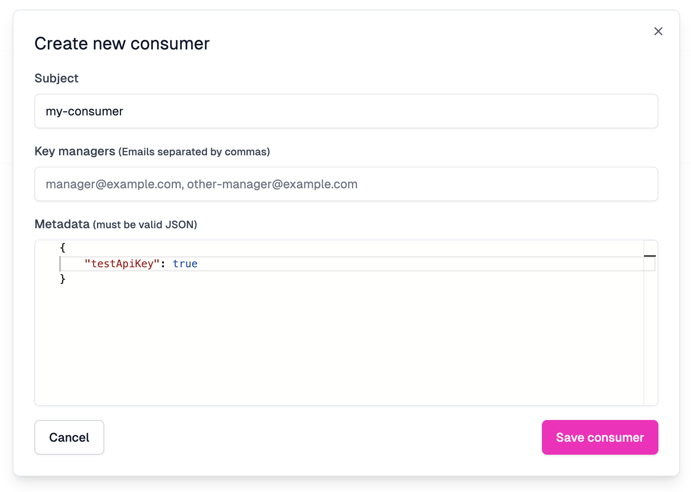

There are times when you need to bypass a policy for purposes such as testing,
debugging, writing health checks, etc. This guide will show you a few ways to
bypass a policy.

## Bypass a Policy Using a Test API Key

If you are using Zuplo API Key Authentication and want to create a test API Key
that can bypass a policy, you can quickly do so by using the API Key metadata
and a custom policy.

### Step 1: Create a Custom Policy

The
[Custom Code Inbound Policy](/docs/policies/custom-code-inbound#writing-a-policy)
is essentially a wrapper around whatever policy you want to bypass. In this
example, we will create a custom policy that bypasses the `monetization-inbound`
policy.

This policy first checks for the presence of a `testApiKey` flag in the user's
`data` (which is the API Key metadata). If the flag is present, the policy
returns the request as is. Otherwise, it invokes the `monetization-inbound`
policy using the `invokeInboundPolicy` method on the `ZuploContext` object.

Create the custom policy configuration in the `policies.json` file.

```json title="config/policies.json"
{
    "policies": {
    {
      "name": "monetization-with-bypass-inbound",
      "policyType": "custom-code-inbound",
      "handler": {
        "export": "default",
        "module": "$import(./modules/monetization-with-bypass)",
        "options": {
          "config1": "YOUR_VALUE",
          "config2": true
        }
      },
    }
  }
}
```

Create a new module for the policy code.

```ts title="modules/monetization-with-bypass.ts"
export default async function policy(
  request: ZuploRequest,
  context: ZuploContext,
) {
  if (request.user.data.testApiKey === true) {
    context.log.info("Bypassing monetization-inbound policy for testing.");
    return request;
  }

  return context.invokeInboundPolicy("monetization-inbound", request);
}
```

### Step 2: Replace the Monetization Policy with the Custom Policy

Wherever you use the `monetization-inbound` policy, replace it with the custom
the custom policy.

```json title="config/routes.oas.json"
"x-zuplo-route": {
  "corsPolicy": "none",
  "handler": {
    "export": "default",
    "module": "$import(./modules/todos-and-users)",
    "options": {}
  },
  "policies": {
    "inbound": ["monetization-with-bypass-inbound"]
  }
}
```

### Step 3: Create a Test API Key

To create a test API Key, navigate to **Services** in your Zuplo Project. Select
the API Key Bucket you want to use and click **Create Consumer**. Enter a name
for the consumer. Set the metadata to include the `testApiKey` flag as shown
below.



Now when you call the API with the test API Key, the `monetization-inbound`
policy will be bypassed.

## Use a JWT Token Claim

In the above example, we used the API Key metadata to bypass the policy.
However, if you are using JWT authentication, you can follow the same principle
by adding a custom claim to the JWT token. Many providers, like
[Auth0](https://auth0.com/docs/secure/tokens/json-web-tokens/create-custom-claims),
allow you to add custom claims to the JWT token.

The claims for a JWT token are added to the `request.user.data` object when you
use one of the Zuplo JWT Authentication policies. So you can use the same code
as the previous API Token example, by adding a custom `testApiKey` claim to the
JWT token.
